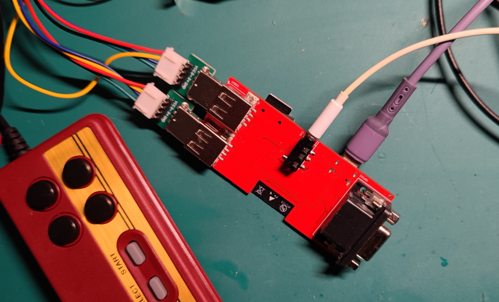
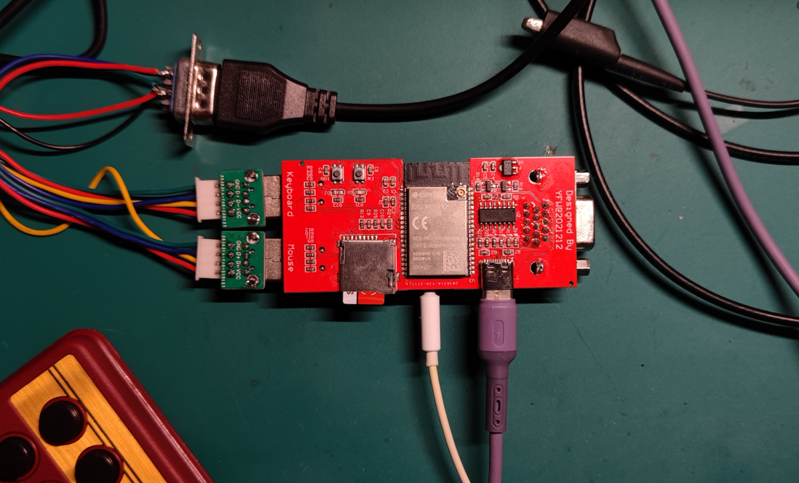
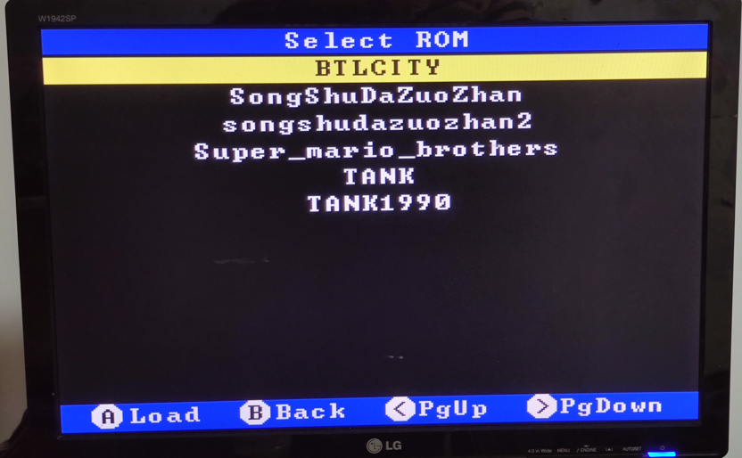
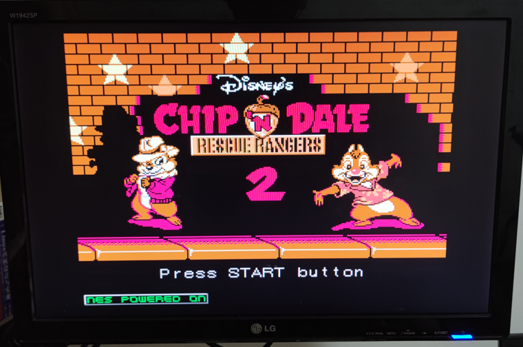

# [XBW] 一个基于VGA显示器的小霸王复刻
> 一直想做一个小霸王游戏机，毕竟8090后都对这个玩意不陌生
> 借助开源的力量，也拖拖拉拉也赶在春节前做好，让小孩子玩了一把，自己也能回味一下
>
> 总之是个比较有意思的小项目，现在也开源出来吧

    
    

## 演示视频
**菜单选项**
    

**游戏画面**
    

> * [https://www.bilibili.com/video/BV1AS4y1V7Dq/](https://www.bilibili.com/video/BV1AS4y1V7Dq/)

## 固件编译说明
这里使用的是ESP32-WROVER-E搭配ESP32-IDF V3.3.5进行编译
相信会ESP32的编译都不是问题 :D

使用TF卡需要注意GPIO12引脚的配置，需要使用修改efuse

## 感谢
> * [FABGL](http://www.fabglib.org/)
> * [ESP32-Nofrendo](https://github.com/espressif/esp32-nesemu)
> * [ESPLAY](https://github.com/pebri86/esplay_micro_hardware)
> * [吐槽坑儿](https://space.bilibili.com/31312385)

## 支持
如果你觉得这个项目有点意思，欢迎打赏一杯奶茶，给媳妇喝。
    
